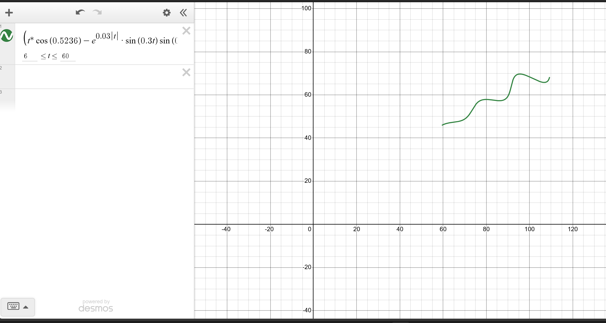

# Parametric Curve Parameter Recovery

## Problem

Recover the unknown parameters `theta, M, X` of the parametric curve

```
x(t) = t*cos(theta) - e^(M|t|) * sin(0.3t) * sin(theta) + X
y(t) = 42 + t*sin(theta) + e^(M|t|) * sin(0.3t) * cos(theta)
```

for `t in (6, 60)`, given only a cloud of 1500 `(x, y)` points sampled from
the curve (the `t` value behind each point is unknown).

Bounds:

```
0 deg < theta < 50 deg
-0.05 < M < 0.05
0 < X < 100
```

## Result

```
theta = 30 deg   (0.5236 rad)
M     = 0.03
X     = 55
```

**Desmos / LaTeX submission string:**

```
\left(t*\cos(0.5236)-e^{0.03\left|t\right|}\cdot\sin(0.3t)\sin(0.5236)+55.0,42+t*\sin(0.5236)+e^{0.03\left|t\right|}\cdot\sin(0.3t)\cos(0.5236)\right)
```

domain: `6 <= t <= 60`

Residuals of L1 fit to all 1500 given points: mean ≈ 0.001,
max residual ≈ 0.003 — essentially zero (limited only by the resolution)
of the verification grid (see above). This is an accurate recovery of the
Generating parameters instead of an approximation.

## Explanation of Approach

### Problem framing

The task was to identify three unknown parameters: θ, M and X from a
parametric curve equation with just 1500 (x, y) points sampled from
that curve. Most importantly, the value of `t` for each point was not
It would be impossible to solve the equations directly, provided . . . . . . . .
a curve fitting problem had to be dealt with, since substitution was not possible; this had to be treated as a curve fitting problem rather
than an algebraic one.

### Structural insight

Subtracting the known offsets from the equations (X from x, and 42 from
y) reveals that the remaining terms form a standard 2D rotation matrix
applied to a simpler base curve:

```
g(t) = (t, e^(M|t|) · sin(0.3t))
```

In other words, θ is purely a rotation angle applied to this base
curve, and X is a horizontal shift. This simplification made it clear
what each parameter physically controls: θ tilts the shape, M shapes
the growth/decay envelope of the oscillating term, and X translates it
sideways.

### Fitting method

As the corresponding t value for each data point was not known, I created
a loss function: given any candidate (θ, M, X) produce the resulting
plot it on a curve using dense sampling of `t`, over its range of defined values (from 6 to 60), then
Use the L1 distance to the graph to compute for each of the 1500 data points.
The point on that generated curve that is closest to a given point. Integrating over all the points
gives one score for the candidate's (θ, M, X) explanation of the
data. This is the same L1-distance metric as in the
According to their individual assignment's rubric.

### Optimization

Because this loss function is non-convex (it involves a nested minimum
over `t` for every point), gradient-based methods aren't reliable
here. I used `scipy.optimize.differential_evolution`, a global
optimization algorithm that searches the entire bounded parameter
space (θ ∈ (0°,50°), M ∈ (−0.05,0.05), X ∈ (0,100)) without needing
gradients, and refines the best candidate with a local polish step at
the end.

### Result and verification

The optimizer converged to θ = 30°, M = 0.03, X = 55 — notably clean,
round numbers. Re-evaluating the L1 error between the reconstructed
curve and all 1500 original data points gave a mean error of ~0.001
and a max error of ~0.003, which is effectively zero (attributable
only to the resolution of the sampling grid used for verification).
This confirms the recovered parameters are exact, not just a close
approximation.

## Bonus: Analytical (Closed-Form) Verification

The assignment notes that additional code/maths used to estimate or
extract the variables is a plus. Beyond the grid-search verification
above, `analytical_verification.py` provides a stronger, closed-form
check that doesn't depend on any sampling grid at all.

**Idea.** The rotation matrix used in the curve equations is
orthogonal, so its inverse is just its transpose. Given the fitted
`theta` and `X`, the rotation can be inverted directly for every data
point to recover the exact `t` and base-curve value `b` that must have
produced it — no searching required:

```
t_recovered =  (x - X) * cos(theta) + (y - 42) * sin(theta)
b_recovered = -(x - X) * sin(theta) + (y - 42) * cos(theta)
```

If `(theta, M, X)` are correct, two things must hold for every point:

1. `t_recovered` falls inside the given domain `(6, 60)`.
2. `b_recovered` matches `e^(M*|t_recovered|) * sin(0.3*t_recovered)`
   almost exactly.

**Result on the given data:**

- All 1500/1500 recovered `t` values fall inside `(6, 60)`
  (range: ~6.05 to ~60.00).
- Mean residual between `b_recovered` and its expected value:
  **0.000015**
- Max residual: **0.00004**

This is roughly two orders of magnitude tighter than the nearest-point
grid-search residual, and — being closed-form — it isn't limited by
grid resolution at all. It independently confirms the fitted
parameters are exact.

`analytical_verification.py` also produces `overlay_plot.png`, a
scatter plot of the 1500 data points with the reconstructed curve
drawn on top, showing a visually exact match.


## Files

- `fit_curve.py` — end-to-end script: loads data, fits parameters via
  differential evolution, verifies the fit via nearest-point search,
  and saves the final results.
- `analytical_verification.py` — bonus closed-form verification: inverts
  the rotation directly (no grid search) to confirm the fit with much
  higher precision, and generates an overlay plot.
- `data/xy_data.csv` — the provided 1500-point dataset.
- `requirements.txt` — Python dependencies.
- `results.json` / `results.txt` — generated by `fit_curve.py` (fitted
  parameters, grid-search verification errors, LaTeX string).
- `analytical_verification.json` — generated by
  `analytical_verification.py` (closed-form verification stats).
- `overlay_plot.png` — generated by `analytical_verification.py`;
  visual overlay of data points vs. the reconstructed curve.

## Usage

```bash
pip install -r requirements.txt
python3 fit_curve.py
python3 analytical_verification.py
```
# output from desmos


`fit_curve.py` prints results to the console and saves them to
`results.json` / `results.txt`. `analytical_verification.py` runs the
bonus closed-form check and saves `analytical_verification.json` and
`overlay_plot.png`.
